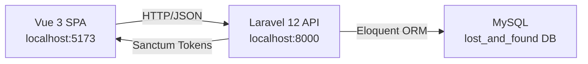
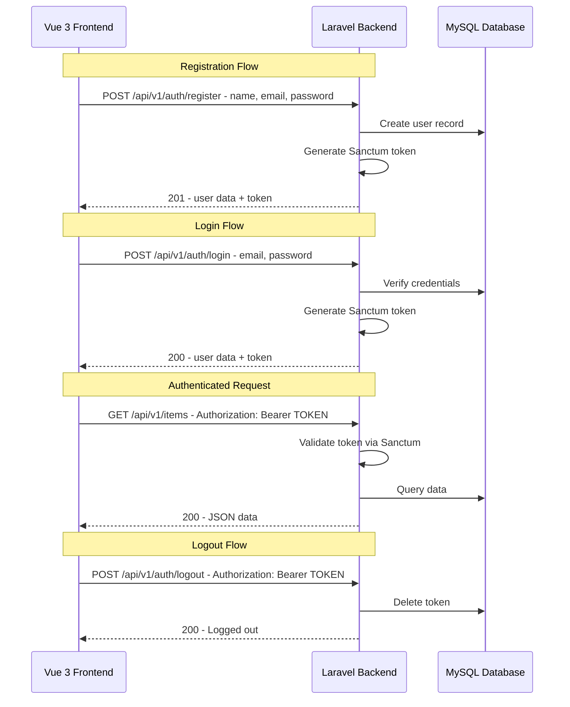
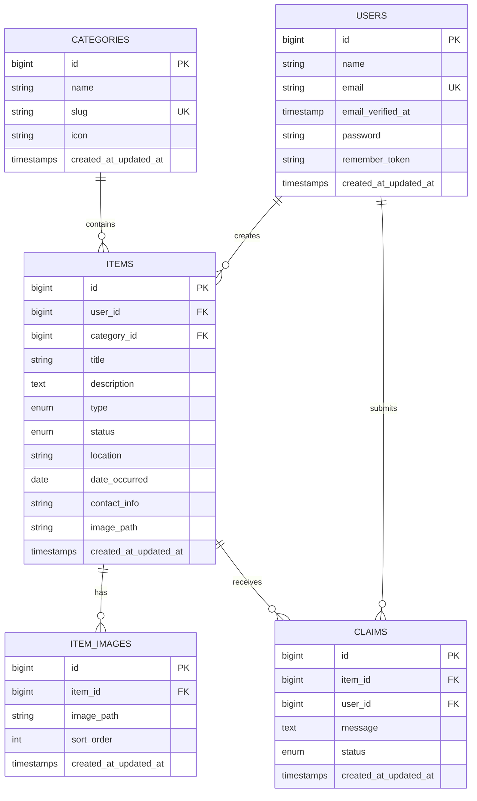

# Lost and Found — API Base Architecture

> **Version:** 1.0
> **Date:** 2026-04-04
> **Stack:** Laravel 12 (Backend) + Vue 3 (Frontend) on XAMPP (Windows)

---

## Table of Contents

1. [Architecture Overview](#1-architecture-overview)
2. [API Structure & Conventions](#2-api-structure--conventions)
3. [Authentication Strategy](#3-authentication-strategy)
4. [CORS Configuration](#4-cors-configuration)
5. [Backend API Base Setup](#5-backend-api-base-setup)
6. [Frontend Integration Plan](#6-frontend-integration-plan)
7. [Database Schema Overview](#7-database-schema-overview)
8. [Proposed File Structure](#8-proposed-file-structure)
9. [Implementation Checklist](#9-implementation-checklist)

---

## 1. Architecture Overview

This application follows a **fully decoupled SPA architecture** where the Laravel 12 backend serves exclusively as a JSON API, and the Vue 3 frontend is a standalone single-page application.



| Component | URL | Purpose |
|-----------|-----|---------|
| Frontend - Vue 3 + Vite | `http://localhost:5173` | User interface, routing, state |
| Backend - Laravel 12 | `http://localhost:8000` | REST API, auth, business logic |
| Database - MySQL | `127.0.0.1:3306` | Data persistence |

### Current State Issues to Address

| Issue | Location | Fix Required |
|-------|----------|-------------|
| API routes not registered in app bootstrap | `bootstrap/app.php` | Add `api:` parameter to `withRouting()` |
| `api.php` returns a Blade view instead of JSON | `routes/api.php` | Replace with proper API routes |
| No Sanctum package installed | `composer.json` | Run `composer require laravel/sanctum` |
| No CORS configuration | N/A | Sanctum handles CORS or publish CORS config |
| Axios missing from Frontend | `Frontend/package.json` | Run `npm install axios` in Frontend |
| No `sanctum` guard configured | `config/auth.php` | Add Sanctum guard after install |

---

## 2. API Structure & Conventions

### 2.1 URL Prefix Convention

All API endpoints use a versioned prefix:

```
/api/v1/{resource}
```

Examples:
```
GET    /api/v1/items          → List all lost/found items
POST   /api/v1/items          → Create a new item
GET    /api/v1/items/{id}     → Get a single item
PUT    /api/v1/items/{id}     → Update an item
DELETE /api/v1/items/{id}     → Delete an item
POST   /api/v1/auth/login     → Login
POST   /api/v1/auth/register  → Register
POST   /api/v1/auth/logout    → Logout
```

### 2.2 RESTful Design Principles

| Principle | Convention |
|-----------|-----------|
| Resource naming | Plural nouns: `/items`, `/categories`, `/users` |
| HTTP verbs | `GET` = read, `POST` = create, `PUT/PATCH` = update, `DELETE` = remove |
| Nesting | Max 1 level deep: `/items/{id}/claims` — not deeper |
| Filtering | Query params: `?status=lost&category=electronics` |
| Pagination | Query params: `?page=1&per_page=15` |
| Sorting | Query params: `?sort_by=created_at&sort_dir=desc` |
| Searching | Query params: `?search=wallet` |

### 2.3 JSON Response Format

All API responses follow a standardized envelope format:

**Success Response:**
```json
{
  "success": true,
  "message": "Items retrieved successfully.",
  "data": {
    "items": [],
    "pagination": {
      "current_page": 1,
      "last_page": 5,
      "per_page": 15,
      "total": 73
    }
  }
}
```

**Single Resource Response:**
```json
{
  "success": true,
  "message": "Item retrieved successfully.",
  "data": {
    "id": 1,
    "title": "Lost Wallet",
    "description": "Black leather wallet..."
  }
}
```

**Error Response:**
```json
{
  "success": false,
  "message": "Validation failed.",
  "errors": {
    "title": ["The title field is required."],
    "category_id": ["The selected category is invalid."]
  }
}
```

**Auth Error Response:**
```json
{
  "success": false,
  "message": "Unauthenticated."
}
```

### 2.4 HTTP Status Code Conventions

| Code | Usage |
|------|-------|
| `200 OK` | Successful GET, PUT/PATCH requests |
| `201 Created` | Successful POST that creates a resource |
| `204 No Content` | Successful DELETE |
| `400 Bad Request` | Malformed request syntax |
| `401 Unauthorized` | Missing or invalid authentication |
| `403 Forbidden` | Authenticated but not authorized for the action |
| `404 Not Found` | Resource does not exist |
| `422 Unprocessable Entity` | Validation errors |
| `429 Too Many Requests` | Rate limit exceeded |
| `500 Internal Server Error` | Unexpected server error |

### 2.5 API Versioning Strategy

- **URL-based versioning** (`/api/v1/...`) — simple, explicit, cache-friendly
- All v1 routes are grouped under `App\Http\Controllers\Api\V1\`
- When breaking changes are needed, create a `v2` namespace without disrupting `v1`
- Route file organization: `routes/api.php` includes version group files as needed

---

## 3. Authentication Strategy

### 3.1 Why Laravel Sanctum

Laravel Sanctum is the recommended authentication package for SPAs communicating with a Laravel API. For this project, we will use **Sanctum token-based authentication** (API tokens) rather than cookie-based SPA authentication because:

- The frontend and backend run on different ports (5173 vs 8000)
- Token auth is simpler to configure for cross-origin setups on XAMPP
- No cookie/session domain matching required
- Easier to debug and test

### 3.2 Auth Flow



### 3.3 Auth Endpoints

| Method | Endpoint | Auth Required | Description |
|--------|----------|---------------|-------------|
| `POST` | `/api/v1/auth/register` | No | Register a new user |
| `POST` | `/api/v1/auth/login` | No | Login and receive token |
| `POST` | `/api/v1/auth/logout` | Yes | Revoke current token |
| `GET`  | `/api/v1/auth/user` | Yes | Get authenticated user profile |

### 3.4 Route Protection

```php
// Public routes — no auth required
Route::prefix('v1')->group(function () {
    Route::post('auth/register', [AuthController::class, 'register']);
    Route::post('auth/login', [AuthController::class, 'login']);

    // Public item browsing
    Route::get('items', [ItemController::class, 'index']);
    Route::get('items/{item}', [ItemController::class, 'show']);
});

// Protected routes — require valid Sanctum token
Route::prefix('v1')->middleware('auth:sanctum')->group(function () {
    Route::post('auth/logout', [AuthController::class, 'logout']);
    Route::get('auth/user', [AuthController::class, 'user']);

    Route::apiResource('items', ItemController::class)->except(['index', 'show']);
    // ... other protected endpoints
});
```

### 3.5 Middleware Setup

In `bootstrap/app.php`, configure middleware:

```php
->withMiddleware(function (Middleware $middleware) {
    $middleware->statefulApi();  // If using SPA cookie auth (optional)

    // Or for token-only: just ensure api middleware group includes
    // throttle and Sanctum's middleware
})
```

The `HasApiTokens` trait must be added to the `User` model after Sanctum is installed.

---

## 4. CORS Configuration

### 4.1 The Problem

The Vue 3 frontend at `http://localhost:5173` makes requests to the Laravel API at `http://localhost:8000`. Browsers block these cross-origin requests unless the server explicitly allows them via CORS headers.

### 4.2 Laravel CORS Configuration

Laravel 12 includes CORS support via the `HandleCors` middleware. Publish or create the CORS configuration:

**`config/cors.php`** (create this file):
```php
<?php

return [
    'paths' => ['api/*', 'sanctum/csrf-cookie'],

    'allowed_methods' => ['*'],

    'allowed_origins' => [
        'http://localhost:5173',  // Vite dev server
        'http://localhost:4173',  // Vite preview
    ],

    'allowed_origins_patterns' => [],

    'allowed_headers' => ['*'],

    'exposed_headers' => [],

    'max_age' => 0,

    'supports_credentials' => true,  // Required for Sanctum cookie auth
];
```

### 4.3 Environment Variables for CORS

Add to `.env`:
```
FRONTEND_URL=http://localhost:5173
SANCTUM_STATEFUL_DOMAINS=localhost:5173
SESSION_DOMAIN=localhost
```

These values configure Sanctum and CORS to accept requests from the Vue dev server.

---

## 5. Backend API Base Setup

### 5.1 Base API Controller

Create a base controller with standardized response helpers. All API controllers inherit from this.

**`App\Http\Controllers\Api\BaseController`**

```php
<?php

namespace App\Http\Controllers\Api;

use App\Http\Controllers\Controller;

class BaseController extends Controller
{
    protected function success($data = null, string $message = 'Success', int $code = 200)
    {
        return response()->json([
            'success' => true,
            'message' => $message,
            'data'    => $data,
        ], $code);
    }

    protected function created($data = null, string $message = 'Created successfully')
    {
        return $this->success($data, $message, 201);
    }

    protected function error(string $message = 'Error', int $code = 400, $errors = null)
    {
        $response = [
            'success' => false,
            'message' => $message,
        ];

        if ($errors) {
            $response['errors'] = $errors;
        }

        return response()->json($response, $code);
    }

    protected function notFound(string $message = 'Resource not found')
    {
        return $this->error($message, 404);
    }

    protected function unauthorized(string $message = 'Unauthorized')
    {
        return $this->error($message, 401);
    }
}
```

### 5.2 Form Request Validation

Use dedicated Form Request classes for validation. Organize by API version:

```
app/Http/Requests/Api/V1/
├── Auth/
│   ├── LoginRequest.php
│   └── RegisterRequest.php
├── Item/
│   ├── StoreItemRequest.php
│   └── UpdateItemRequest.php
```

Each Form Request must override `failedValidation()` to return JSON:

```php
use Illuminate\Contracts\Validation\Validator;
use Illuminate\Http\Exceptions\HttpResponseException;

protected function failedValidation(Validator $validator)
{
    throw new HttpResponseException(response()->json([
        'success' => false,
        'message' => 'Validation failed.',
        'errors'  => $validator->errors(),
    ], 422));
}
```

### 5.3 API Resource / Transformer Classes

Use Laravel API Resources to transform Eloquent models into JSON:

```
app/Http/Resources/V1/
├── UserResource.php
├── ItemResource.php
├── ItemCollection.php
├── CategoryResource.php
```

Example `ItemResource`:
```php
<?php

namespace App\Http\Resources\V1;

use Illuminate\Http\Request;
use Illuminate\Http\Resources\Json\JsonResource;

class ItemResource extends JsonResource
{
    public function toArray(Request $request): array
    {
        return [
            'id'          => $this->id,
            'title'       => $this->title,
            'description' => $this->description,
            'type'        => $this->type,       // 'lost' or 'found'
            'status'      => $this->status,
            'location'    => $this->location,
            'image_url'   => $this->image_url,
            'category'    => new CategoryResource($this->whenLoaded('category')),
            'user'        => new UserResource($this->whenLoaded('user')),
            'created_at'  => $this->created_at->toISOString(),
            'updated_at'  => $this->updated_at->toISOString(),
        ];
    }
}
```

### 5.4 Exception Handling for API

Configure global exception handling in `bootstrap/app.php` to always return JSON for API routes:

```php
->withExceptions(function (Exceptions $exceptions) {
    $exceptions->shouldRenderJsonWhen(function ($request) {
        return $request->is('api/*') || $request->expectsJson();
    });

    $exceptions->render(function (NotFoundHttpException $e, $request) {
        if ($request->is('api/*')) {
            return response()->json([
                'success' => false,
                'message' => 'Resource not found.',
            ], 404);
        }
    });

    $exceptions->render(function (AuthenticationException $e, $request) {
        if ($request->is('api/*')) {
            return response()->json([
                'success' => false,
                'message' => 'Unauthenticated.',
            ], 401);
        }
    });

    $exceptions->render(function (ThrottleRequestsException $e, $request) {
        if ($request->is('api/*')) {
            return response()->json([
                'success' => false,
                'message' => 'Too many requests. Please try again later.',
            ], 429);
        }
    });
})
```

### 5.5 Rate Limiting

Configure in `AppServiceProvider@boot`:

```php
use Illuminate\Cache\RateLimiting\Limit;
use Illuminate\Support\Facades\RateLimiter;

public function boot(): void
{
    RateLimiter::for('api', function ($request) {
        return Limit::perMinute(60)->by($request->user()?->id ?: $request->ip());
    });

    RateLimiter::for('auth', function ($request) {
        return Limit::perMinute(5)->by($request->ip());
    });
}
```

Apply rate limiters in routes:
```php
Route::middleware('throttle:auth')->group(function () {
    Route::post('auth/login', [AuthController::class, 'login']);
    Route::post('auth/register', [AuthController::class, 'register']);
});
```

---

## 6. Frontend Integration Plan

### 6.1 Axios Instance Configuration

Create a centralized Axios instance with base URL and interceptors.

**`Frontend/src/lib/axios.js`**:
```js
import axios from 'axios'
import { useAuthStore } from '@/stores/auth'
import router from '@/router'

const api = axios.create({
  baseURL: import.meta.env.VITE_API_BASE_URL || 'http://localhost:8000/api/v1',
  headers: {
    'Content-Type': 'application/json',
    'Accept': 'application/json',
  },
  timeout: 10000,
})

// Request interceptor — attach auth token
api.interceptors.request.use(
  (config) => {
    const authStore = useAuthStore()
    if (authStore.token) {
      config.headers.Authorization = `Bearer ${authStore.token}`
    }
    return config
  },
  (error) => Promise.reject(error)
)

// Response interceptor — handle errors globally
api.interceptors.response.use(
  (response) => response,
  (error) => {
    const { response } = error

    if (response?.status === 401) {
      const authStore = useAuthStore()
      authStore.clearAuth()
      router.push({ name: 'login' })
    }

    if (response?.status === 429) {
      // Rate limited — could show a toast notification
      console.warn('Rate limited. Please wait before retrying.')
    }

    return Promise.reject(error)
  }
)

export default api
```

### 6.2 Environment Variables

**`Frontend/.env`** (create):
```
VITE_API_BASE_URL=http://localhost:8000/api/v1
VITE_APP_NAME="Lost and Found"
```

**`Frontend/.env.production`** (create for production):
```
VITE_API_BASE_URL=https://your-production-domain.com/api/v1
VITE_APP_NAME="Lost and Found"
```

### 6.3 Auth Token Management

**`Frontend/src/stores/auth.js`** (Pinia store):
```js
import { defineStore } from 'pinia'
import { ref, computed } from 'vue'
import api from '@/lib/axios'

export const useAuthStore = defineStore('auth', () => {
  const user = ref(JSON.parse(localStorage.getItem('user') || 'null'))
  const token = ref(localStorage.getItem('token') || null)

  const isAuthenticated = computed(() => !!token.value)

  function setAuth(userData, tokenValue) {
    user.value = userData
    token.value = tokenValue
    localStorage.setItem('user', JSON.stringify(userData))
    localStorage.setItem('token', tokenValue)
  }

  function clearAuth() {
    user.value = null
    token.value = null
    localStorage.removeItem('user')
    localStorage.removeItem('token')
  }

  async function login(credentials) {
    const response = await api.post('/auth/login', credentials)
    setAuth(response.data.data.user, response.data.data.token)
    return response.data
  }

  async function register(data) {
    const response = await api.post('/auth/register', data)
    setAuth(response.data.data.user, response.data.data.token)
    return response.data
  }

  async function logout() {
    try {
      await api.post('/auth/logout')
    } finally {
      clearAuth()
    }
  }

  async function fetchUser() {
    const response = await api.get('/auth/user')
    user.value = response.data.data
    localStorage.setItem('user', JSON.stringify(response.data.data))
    return response.data
  }

  return {
    user,
    token,
    isAuthenticated,
    setAuth,
    clearAuth,
    login,
    register,
    logout,
    fetchUser,
  }
})
```

### 6.4 API Service Layer

Organize API calls into service files — one per resource. Services use the centralized Axios instance.

```
Frontend/src/services/
├── authService.js      → Login, register, logout, profile
├── itemService.js      → CRUD for lost/found items
├── categoryService.js  → List categories
├── claimService.js     → Claim management
```

Example **`Frontend/src/services/itemService.js`**:
```js
import api from '@/lib/axios'

export const itemService = {
  getAll(params = {}) {
    return api.get('/items', { params })
  },

  getById(id) {
    return api.get(`/items/${id}`)
  },

  create(data) {
    return api.post('/items', data)
  },

  update(id, data) {
    return api.put(`/items/${id}`, data)
  },

  delete(id) {
    return api.delete(`/items/${id}`)
  },
}
```

### 6.5 Vue Router Auth Guards

Protect frontend routes that require authentication:

```js
import { useAuthStore } from '@/stores/auth'

router.beforeEach((to, from, next) => {
  const authStore = useAuthStore()

  if (to.meta.requiresAuth && !authStore.isAuthenticated) {
    next({ name: 'login', query: { redirect: to.fullPath } })
  } else if (to.meta.guest && authStore.isAuthenticated) {
    next({ name: 'home' })
  } else {
    next()
  }
})
```

---

## 7. Database Schema Overview

### 7.1 Existing Tables

| Table | Status | Description |
|-------|--------|-------------|
| `users` | ✅ Migration exists | Standard Laravel users |
| `password_reset_tokens` | ✅ Migration exists | Password reset functionality |
| `sessions` | ✅ Migration exists | Database sessions |
| `personal_access_tokens` | 🔲 Created by Sanctum | Sanctum API tokens |

### 7.2 Application Tables (To Be Created)

These tables will be needed for the Lost and Found domain. This is an outline only — detailed migrations will be planned separately.

| Table | Purpose | Key Columns |
|-------|---------|-------------|
| `categories` | Categorize items | `id`, `name`, `slug`, `icon`, `timestamps` |
| `items` | Core lost/found items | `id`, `user_id`, `category_id`, `title`, `description`, `type` (lost/found), `status` (open/resolved/closed), `location`, `date_occurred`, `contact_info`, `image_path`, `timestamps` |
| `item_images` | Multiple images per item | `id`, `item_id`, `image_path`, `sort_order`, `timestamps` |
| `claims` | Claims on found items | `id`, `item_id`, `user_id`, `message`, `status` (pending/approved/rejected), `timestamps` |

### 7.3 Entity Relationship Diagram



---

## 8. Proposed File Structure

### 8.1 Backend Directory Structure

```
Backend/
├── app/
│   ├── Http/
│   │   ├── Controllers/
│   │   │   ├── Controller.php                          ← Existing base
│   │   │   └── Api/
│   │   │       ├── BaseController.php                  ← NEW: Shared response helpers
│   │   │       └── V1/
│   │   │           ├── AuthController.php              ← NEW: Login, register, logout
│   │   │           ├── ItemController.php              ← NEW: CRUD for items
│   │   │           ├── CategoryController.php          ← NEW: List/manage categories
│   │   │           ├── ClaimController.php             ← NEW: Claim management
│   │   │           └── UserController.php              ← NEW: User profile
│   │   ├── Requests/
│   │   │   └── Api/
│   │   │       └── V1/
│   │   │           ├── Auth/
│   │   │           │   ├── LoginRequest.php            ← NEW
│   │   │           │   └── RegisterRequest.php         ← NEW
│   │   │           └── Item/
│   │   │               ├── StoreItemRequest.php        ← NEW
│   │   │               └── UpdateItemRequest.php       ← NEW
│   │   └── Resources/
│   │       └── V1/
│   │           ├── UserResource.php                    ← NEW
│   │           ├── ItemResource.php                    ← NEW
│   │           ├── ItemCollection.php                  ← NEW
│   │           └── CategoryResource.php                ← NEW
│   ├── Models/
│   │   ├── User.php                                    ← MODIFY: Add HasApiTokens
│   │   ├── Item.php                                    ← NEW
│   │   ├── Category.php                                ← NEW
│   │   ├── ItemImage.php                               ← NEW
│   │   └── Claim.php                                   ← NEW
│   └── Providers/
│       └── AppServiceProvider.php                      ← MODIFY: Add rate limiters
├── bootstrap/
│   └── app.php                                         ← MODIFY: Register API routes, exceptions, middleware
├── config/
│   ├── cors.php                                        ← NEW: CORS configuration
│   ├── sanctum.php                                     ← NEW: Published by Sanctum install
│   └── auth.php                                        ← MODIFY: Add sanctum guard
├── database/
│   └── migrations/
│       ├── 0001_01_01_000000_create_users_table.php    ← Existing
│       ├── xxxx_create_personal_access_tokens_table.php ← Created by Sanctum
│       ├── xxxx_create_categories_table.php            ← NEW
│       ├── xxxx_create_items_table.php                 ← NEW
│       ├── xxxx_create_item_images_table.php           ← NEW
│       └── xxxx_create_claims_table.php                ← NEW
├── docs/
│   └── API_ARCHITECTURE.md                             ← This document
└── routes/
    ├── api.php                                         ← MODIFY: Define all API routes
    └── web.php                                         ← Keep minimal
```

### 8.2 Frontend Directory Structure

```
Frontend/src/
├── assets/                         ← Existing: CSS, images
├── components/                     ← Existing: Reusable Vue components
│   ├── common/                     ← NEW: Shared UI components
│   │   ├── LoadingSpinner.vue
│   │   ├── ErrorAlert.vue
│   │   └── Pagination.vue
│   ├── items/                      ← NEW: Item-related components
│   │   ├── ItemCard.vue
│   │   ├── ItemForm.vue
│   │   └── ItemList.vue
│   └── auth/                       ← NEW: Auth-related components
│       ├── LoginForm.vue
│       └── RegisterForm.vue
├── lib/                            ← NEW: Utilities and config
│   └── axios.js                    ← NEW: Axios instance with interceptors
├── router/
│   └── index.js                    ← MODIFY: Add auth routes, guards
├── services/                       ← NEW: API service layer
│   ├── authService.js
│   ├── itemService.js
│   ├── categoryService.js
│   └── claimService.js
├── stores/                         ← Existing: Pinia stores
│   ├── auth.js                     ← NEW: Auth state management
│   ├── items.js                    ← NEW: Items state management
│   └── counter.js                  ← Existing (can remove later)
├── views/                          ← Existing: Page-level components
│   ├── HomeView.vue                ← MODIFY: Show items listing
│   ├── auth/                       ← NEW
│   │   ├── LoginView.vue
│   │   └── RegisterView.vue
│   ├── items/                      ← NEW
│   │   ├── ItemListView.vue
│   │   ├── ItemDetailView.vue
│   │   └── ItemCreateView.vue
│   └── AboutView.vue              ← Existing
├── App.vue                         ← MODIFY: Add navigation, layout
└── main.js                         ← Existing (no changes needed for base)
```

---

## 9. Implementation Checklist

This is the ordered sequence of steps to implement the API base architecture. Each step should be completed and verified before moving to the next.

### Phase 1: Backend Foundation

- [ ] **1.1** Install Laravel Sanctum: `composer require laravel/sanctum`
- [ ] **1.2** Publish Sanctum config: `php artisan vendor:publish --provider="Laravel\Sanctum\SanctumServiceProvider"`
- [ ] **1.3** Run Sanctum migration for `personal_access_tokens` table: `php artisan migrate`
- [ ] **1.4** Add `HasApiTokens` trait to `User` model
- [ ] **1.5** Register API routes in `bootstrap/app.php` by adding the `api:` parameter to `withRouting()`
- [ ] **1.6** Clean up `routes/api.php` — remove the view return, set up route groups with version prefix
- [ ] **1.7** Create `config/cors.php` with allowed origins for `localhost:5173`
- [ ] **1.8** Update `.env` with `FRONTEND_URL`, `SANCTUM_STATEFUL_DOMAINS`, and `SESSION_DOMAIN`

### Phase 2: API Base Infrastructure

- [ ] **2.1** Create `App\Http\Controllers\Api\BaseController` with standardized response methods
- [ ] **2.2** Configure exception handling in `bootstrap/app.php` for JSON API responses
- [ ] **2.3** Configure rate limiting in `AppServiceProvider` for `api` and `auth` limiters
- [ ] **2.4** Create base Form Request class with JSON validation error responses

### Phase 3: Authentication API

- [ ] **3.1** Create `App\Http\Controllers\Api\V1\AuthController` with register, login, logout, user methods
- [ ] **3.2** Create `App\Http\Requests\Api\V1\Auth\LoginRequest` validation
- [ ] **3.3** Create `App\Http\Requests\Api\V1\Auth\RegisterRequest` validation
- [ ] **3.4** Create `App\Http\Resources\V1\UserResource`
- [ ] **3.5** Define auth routes in `routes/api.php` with public and protected groups
- [ ] **3.6** Test auth endpoints manually or via Postman/Insomnia

### Phase 4: Frontend Base Integration

- [ ] **4.1** Install `axios` in Frontend: `cd Frontend && npm install axios`
- [ ] **4.2** Create `Frontend/.env` with `VITE_API_BASE_URL`
- [ ] **4.3** Create `Frontend/src/lib/axios.js` with Axios instance, interceptors
- [ ] **4.4** Create `Frontend/src/stores/auth.js` Pinia store with token management
- [ ] **4.5** Create `Frontend/src/services/authService.js`
- [ ] **4.6** Update `Frontend/src/router/index.js` with auth routes and navigation guards
- [ ] **4.7** Create basic login and register views/components
- [ ] **4.8** Test full auth flow: register → login → access protected route → logout

### Phase 5: Domain Models & Migrations (Post-Base)

- [ ] **5.1** Create `categories` migration and `Category` model
- [ ] **5.2** Create `items` migration and `Item` model with relationships
- [ ] **5.3** Create `item_images` migration and `ItemImage` model
- [ ] **5.4** Create `claims` migration and `Claim` model
- [ ] **5.5** Create database seeders for categories and test data
- [ ] **5.6** Run migrations: `php artisan migrate`

### Phase 6: Resource API Endpoints (Post-Base)

- [ ] **6.1** Create `ItemController` with full CRUD
- [ ] **6.2** Create `CategoryController` for listing categories
- [ ] **6.3** Create corresponding Form Requests and API Resources
- [ ] **6.4** Create Frontend services and stores for items and categories
- [ ] **6.5** Wire up frontend views to API endpoints

---

> **Note:** Phases 1–4 constitute the "API Base Architecture" and should be implemented first. Phases 5–6 are the domain-specific features that build on top of the base.
