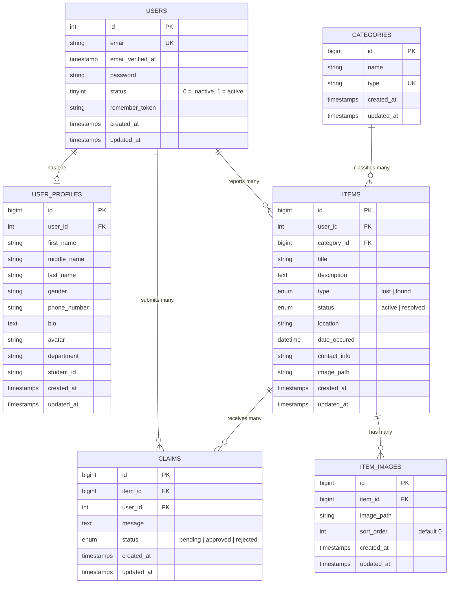
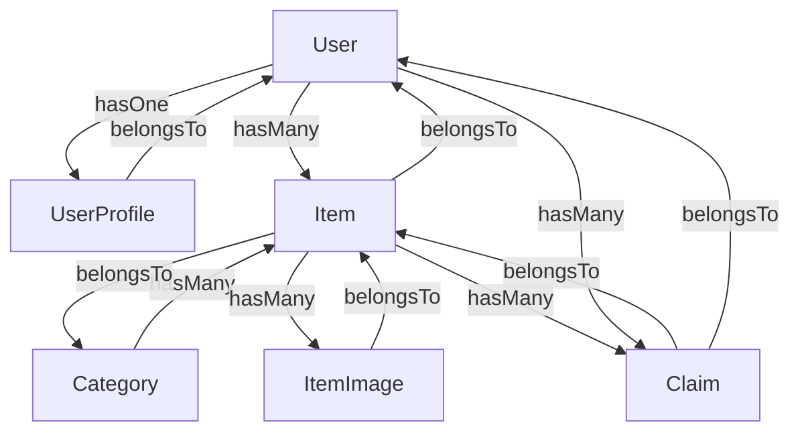
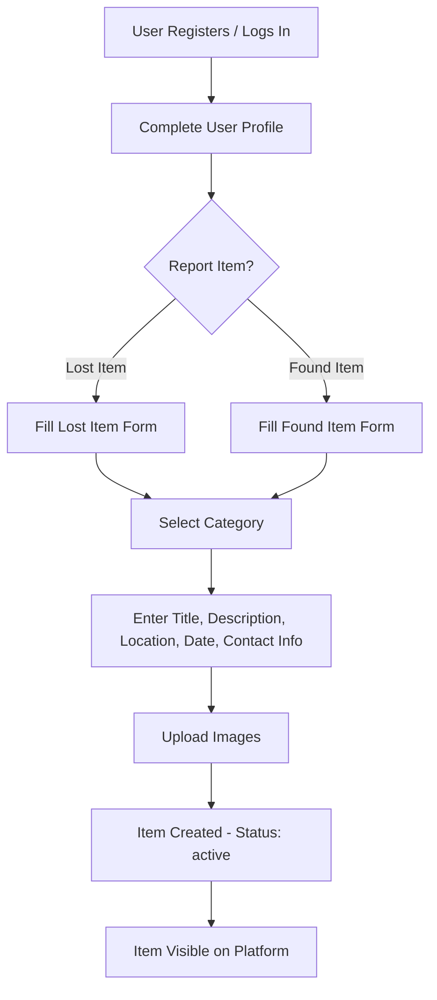
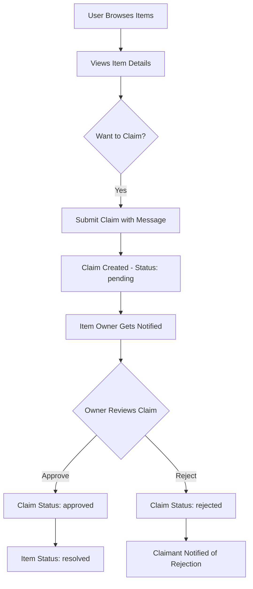

# Lost & Found — Models Flowchart & Entity Relationships

## 1. Entity Relationship Diagram (ERD)

---

## 2. Model Relationship Flow

---

## 3. User Flow — Reporting a Lost/Found Item

---

## 4. User Flow — Claiming an Item

---

## 5. Models Status Overview

| Model | File Exists? | Relationships Defined? | Notes |
|-------|-------------|----------------------|-------|
| **User** | ✅ | `hasOne` UserProfile | Typo in method name: `useProfiles` should be `userProfile` |
| **UserProfile** | ✅ | `belongsTo` User | All fields nullable for progressive profile completion |
| **Categories** | ✅ | None defined yet | Missing `hasMany` Items relationship |
| **Item** | ❌ Not created | N/A | Migration exists but Model class is missing |
| **ItemImage** | ❌ Not created | N/A | Migration exists but Model class is missing |
| **Claim** | ❌ Not created | N/A | Migration exists but Model class is missing |

---

## 6. Observations & Issues Found

1. **Missing Model classes** — `Item`, `ItemImage`, and `Claim` models have migrations but no corresponding Eloquent Model files in `app/Models/`.
2. **Typo in User model** — [`useProfiles()`](Backend/app/Models/User.php:34) should likely be `userProfile()` or `profile()`.
3. **Missing relationships on Categories** — [`Categories`](Backend/app/Models/Categories.php) model has no `hasMany` relationship to Items.
4. **Column typo in claims migration** — [`mesage`](Backend/database/migrations/2026_04_04_160509_claims_table.php:15) should be `message`.
5. **Unnecessary trait on Categories** — [`Notifiable`](Backend/app/Models/Categories.php:7) trait is used on Categories, which is typically only needed for models that receive notifications like User.
6. **PK type mismatch** — Users table uses `$table->increments('id')` which is `unsignedInteger`, while Items/Claims reference `user_id` with `unsignedInteger` — this is consistent. However, Categories uses `$table->id()` which is `unsignedBigInteger`, and Items references `category_id` as `unsignedBigInteger` — also consistent. Just be aware of the mixed PK strategy.
